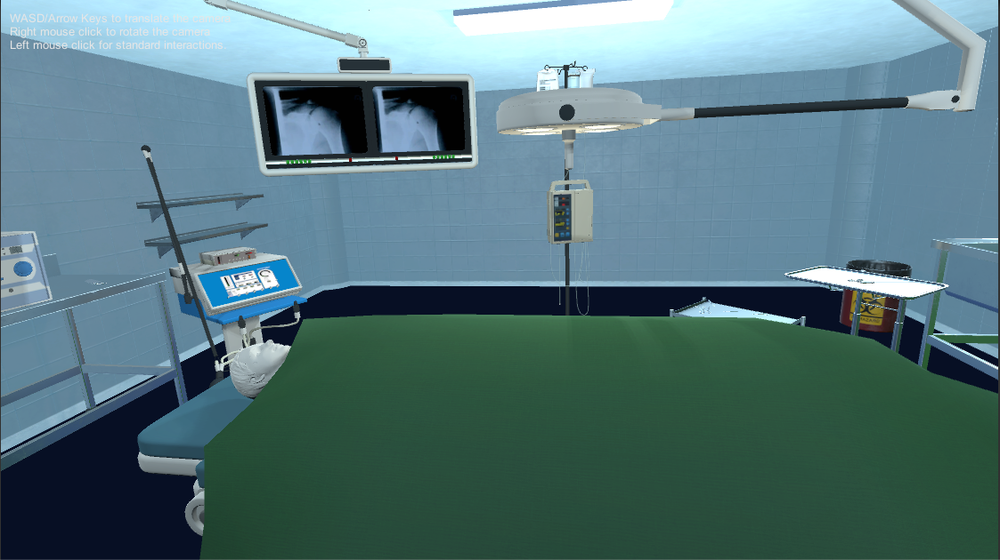

# Unity-VR-BSc-project
Interactive visualisation of medical data / VR
Made with Unity 2017.3.1f1

Summary: An application for the visualization of the 3D medical data of different formats on virtual reality goggles (HTC Vive). The program allows user interaction
with three-dimensional objects thanks to the use of a motion tracking system. Visualization includes spatial models generated from medical imaging data (DICOM).
The application serves an education purpose. 

Scene one:
Surgical room - top of the patient body (real human anatomy) is present on the surgical table. If touched with a specific object (biopsy needle) - the skin disappears, revealing tissues hidden underneath.

Scene two:
A morgue with a number of anatomical models of different formats, mostly .STL (used in medical imaging and 3D printing). Objects are based on real patients data - CT scans (e.g. skull), MRI scans (e.g. lungs) and 3D surface scan (my friend’s face :) ). All of the models and surgical tools can be moved freely using controllers. Collisions are implemented.

Additional features:
1. To enable moving around the scene even in a small room - teleportation feature was implemented. Players can teleport only if there are no objects colliding with their “landing point”.
2. Fridge doors can be opened and closed by the players. If the player inserts their hand inside the fridge, the drawer slides out of the fridge.

